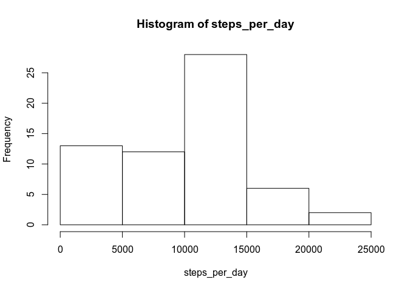
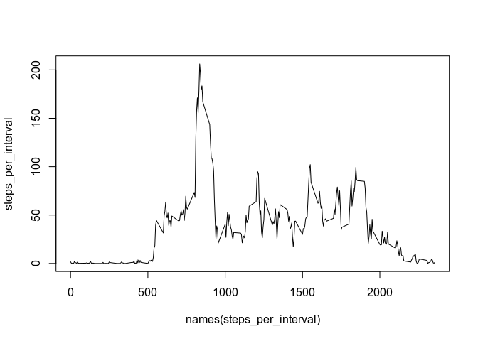
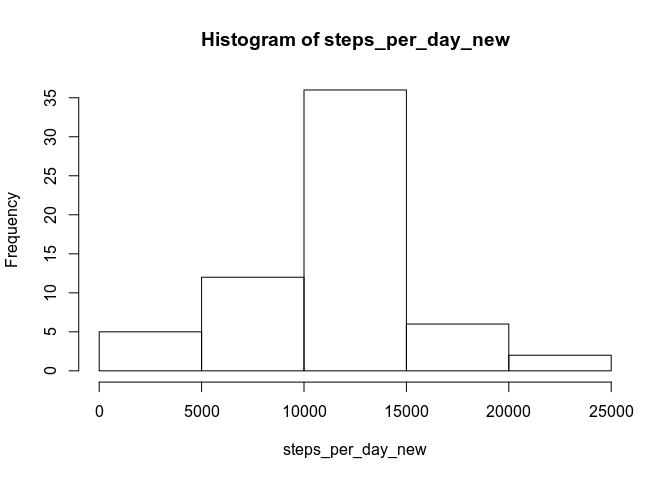
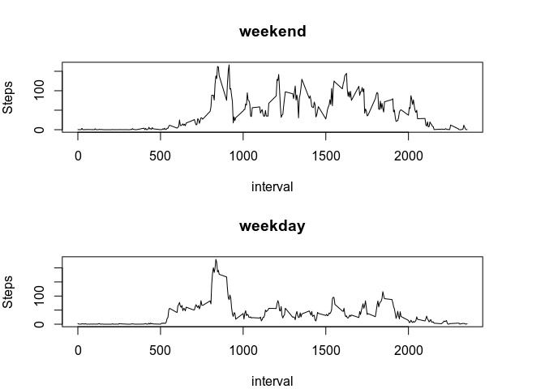

```r
options(scipen=999)
```

## Loading and preprocessing the data

Load dataset and convert data column to R date type:

```r
data <- read.csv("/home/remco/R/RR_assignment1/RepData_PeerAssessment1/activity.csv", stringsAsFactors = FALSE)
data$datetime <- as.Date(data$date, format = "%Y-%m-%d")
```

## What is mean total number of steps taken per day?


```r
steps_per_day <- tapply(data$steps, data$datetime, sum, na.rm=TRUE)
```

A histogram of the number of steps per day

```r
hist(steps_per_day)
```

<!-- -->

```r
meansteps <- mean(steps_per_day)
mediansteps <- median(steps_per_day)
```

Mean steps per day is: 9354.2295082   
Median steps per day is: 10395 


## What is the average daily activity pattern?

A plot of the daily activity pattern per 5 minute interval:


```r
steps_per_interval <- tapply(data$steps, data$interval, mean, na.rm=TRUE)
plot(names(steps_per_interval), steps_per_interval, type="l")
```

<!-- -->

```r
maxinterval <- names(steps_per_interval)[steps_per_interval == max(steps_per_interval)]
```
The interval with the most steps is 835.

## Imputing missing values


```r
missing <- sum(is.na(data$steps))
```
The number of missing values is 2304.

To deal with this, we will replace the missing values with the average for that particular interval. We will put the results in a new dataset:

```r
data$avg <- steps_per_interval[match(data$interval, names(steps_per_interval))]
data_new <- data
data_new$steps <- ifelse(is.na(data_new$steps), data_new$avg, data_new$steps)
```

We will now explore whether the replacement makes a difference:

```r
steps_per_day_new <- tapply(data_new$steps, data_new$datetime, sum)
hist(steps_per_day_new)
```

<!-- -->

```r
mean_new <- mean(steps_per_day_new)
median_new <- median(steps_per_day_new)
```

The mean of steps is now: 10766.1886792  
The median is: 10766.1886792  
The mean and median are now the same, which is expected, since the missing values have been replaced with averages, shifting the distribution closer to the mean.

## Are there differences in activity patterns between weekdays and weekends?

First prepare the weekend and weekday data in the dataset:

```r
data_new$weekday = weekdays(data_new$datetime)
data_new$weekorweekend = ifelse(data_new$weekday == "zaterdag" | data_new$weekday == "zondag", "weekend", "weekday")
data_new$weekorweekend <- as.factor(data_new$weekorweekend)
```

We will then follow the same approach to calculating the average per interval during the week and in the weekend.

```r
steps_per_weekday <- tapply(data_new[data_new$weekorweekend == "weekday",]$steps, data_new[data_new$weekorweekend == "weekday",]$interval, mean)
steps_per_weekend <- tapply(data_new[data_new$weekorweekend == "weekend",]$steps, data_new[data_new$weekorweekend == "weekend",]$interval, mean)
par(mfrow = c(2,1), mar = c(4,4,4,4))
plot(names(steps_per_weekend), steps_per_weekend, type="l", xlab="interval", ylab="Steps", main = "weekend")
plot(names(steps_per_weekday), steps_per_weekday, type="l", xlab="interval", ylab="Steps", main="weekday")
```

<!-- -->

There seems to be more activity on the weekend, spread throughout the day. On weekdays there is a high peak in the morning, and subsequent activity is lower.

